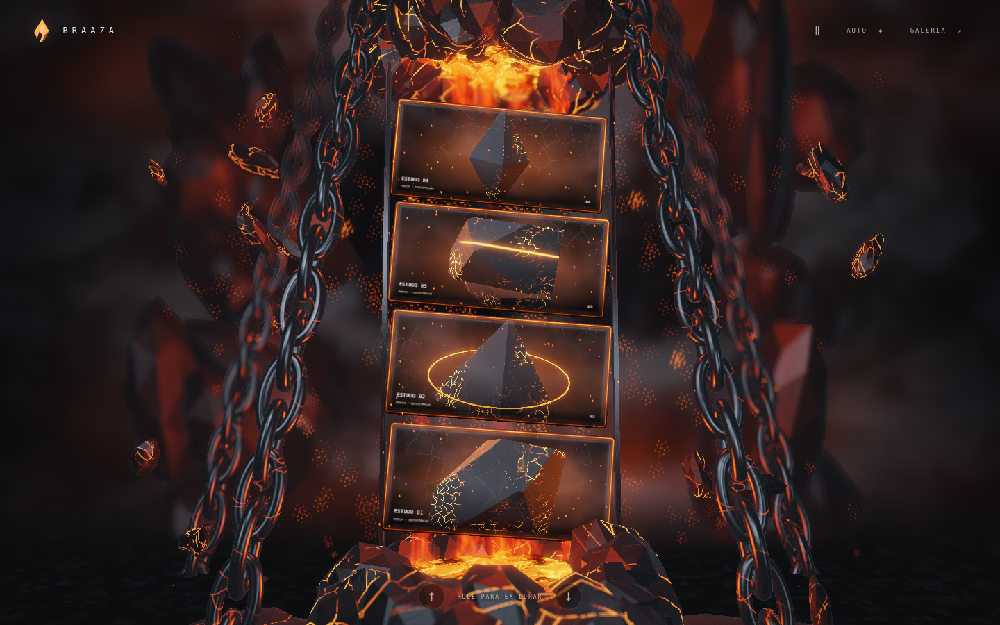

# BRAAZA — auditoria visual de 6 de outubro de 2026

## Versão realmente auditada

A produção já estava no commit [`0e434b8f7df455990f026c8001beb6cc0c9aa302`](https://github.com/ItsDeimox/checkpoint-portfolio/commit/0e434b8f7df455990f026c8001beb6cc0c9aa302), posterior à primeira versão [`0a3729e`](https://github.com/ItsDeimox/checkpoint-portfolio/commit/0a3729eb390a542864868079c5e705f18ac74eb6). O arquivo histórico [VALIDATION.md](VALIDATION.md) descreve a primeira versão; [REFINEMENT.md](REFINEMENT.md) descreve o refinamento que já estava publicado.

O projeto Vercel `braaza`, deployment `dpl_DqFtBUQgdxbhPhhXr8EbYT9DpUuD`, estava `READY` e associado a `https://braaza.vercel.app/`. O [manifesto publicado](https://braaza.vercel.app/build-info.json) respondeu HTTP 200 e identificou `0e434b8`; os hashes SHA-256 dos dez módulos conferiram com o checkout usado como base. A cópia desse manifesto está em [audit/source-before.json](audit/source-before.json).

## Resultado por ponto da direção visual

| Ponto | Evidência nesta rodada | Decisão |
| --- | --- | --- |
| Ambiente mais rico | A versão atual já contém paredes e silhuetas de obsidiana, placas no primeiro plano, duas fornalhas, fumaça e piso com reflexo. As capturas mostram esses elementos. | Preservar a composição existente; não acrescentar objetos sem uma diferença verificável contra a concept. |
| Cor, luz e HDR | Os alvos reais de renderização mantêm valores finitos e não negativos. As demos conservam picos emissivos acima de 1. O teste de chama produz os mesmos resultados antes e depois. | Preservar exposição, paleta, materiais do ambiente e pesos de bloom. |
| Correntes ao fundo | As quatro correntes atuais usam ciclos completos de 56 elos. A inspeção em desktop, mobile e fases de navegação não reproduziu os cortes da primeira versão. | Preservar malhas, posição, reciclagem e movimento. |
| Shader/glow dos cards | O degradê preto usado sob os títulos era composto depois da luz da borda. Na faixa inferior, restavam apenas 20,09% da resposta emissiva de hover do controle sem legenda. | Compor somente a emissão do perímetro depois da legenda. A legenda continua escurecendo a mídia, sem apagar a borda do vidro. |
| Presença das partículas | Os sprites não escrevem profundidade. O pós-processamento usava a profundidade da parede/fundo para desfocar também as centelhas, espalhando uma partícula em vários pontos e reduzindo seu contraste. | Separar a contribuição aditiva das centelhas do desfoque do ambiente. Preservar quantidade, movimento, forma, oclusão e contribuição ao bloom HDR. |

## Alteração de código

O código de produção muda apenas em `src/engine.js` e `src/materials.js`.

Depois de todos os cards terminarem de usar a captura de refração, o renderer reutiliza esse mesmo framebuffer para guardar a cena antes das centelhas. O desfoque passa a amostrar essa base. A diferença positiva entre a cena com centelhas e a base é recomposta antes do bloom e do tone mapping finais. Isso evita que os pontos luminosos herdem o desfoque de uma superfície atrás deles. A extração do bloom continua recebendo a cena com partículas.

Não é criado outro render target. O custo adicional é uma cópia de cor na resolução de renderização e uma amostra central de textura no pós-processamento. O modo leve, que já desliga o desfoque, recompõe a mesma contribuição aditiva. O depth test das partículas permanece ativo e sua escrita de profundidade permanece desativada.

No card, só a emissão do perímetro muda de ordem. O conteúdo da mídia, textos, recorte, transparência de queima, refração, trilha do cursor e geometria continuam iguais. `content.js`, `core.js`, `main.js`, `geometry.js`, `gl.js`, `math.js`, `shaders.js`, CSS, HTML e assets não foram alterados.

## Evidência visual

Capturas reais de Chromium/WebGL2, com o mesmo código da base publicada e com o patch local. Tempo procedural fixo em 3 segundos, navegação em Home, DPR 1. As capturas de hover usam o mesmo ponto na borda inferior do segundo card. O carregador já terminou sua transição em todas as imagens.

| Estado | Antes | Depois |
| --- | --- | --- |
| Desktop, 1440 × 900 | [desktop-before.png](audit/desktop-before.png) | [desktop-after.png](audit/desktop-after.png) |
| Hover inferior, 1440 × 900 | [hover-before.png](audit/hover-before.png) | [hover-after.png](audit/hover-after.png) |
| Mobile emulado, 390 × 844 | [mobile-before.png](audit/mobile-before.png) | [mobile-after.png](audit/mobile-after.png) |

### Antes



### Depois


## Regressões que demonstram os defeitos

Os dois testes em [tests/visual-regressions.py](../tests/visual-regressions.py) foram escritos e executados antes do patch. Ambos falharam na base pelos motivos esperados e passaram depois. Eles renderizam os shaders reais em alvos GPU controlados; não comparam texto de código nem substituem shaders por mocks.

| Medição isolada | Antes | Depois | Critério |
| --- | ---: | ---: | ---: |
| Resposta emissiva de hover retida na borda inferior, com a legenda real | 20,09% | 97,49% | Acima de 85% do controle sem legenda |
| Contraste de uma centelha em foco sobre fundo distante | 17,01% | 100% | Acima de 85% do controle com fundo em foco |

Esses percentuais pertencem aos cenários controlados de regressão. Não são uma medida de fidelidade à concept nem um aumento global de brilho da tela. As medições estão em [audit/visual-regressions.json](audit/visual-regressions.json).

## Verificação

| Verificação após o patch | Resultado | Registro |
| --- | --- | --- |
| Node | 21 de 21 passaram | Suite existente, sem alterações |
| Build estático | Passou | `npm run build` |
| Renderização GPU | 13 de 13 passaram | [render-after.json](audit/render-after.json) |
| Interações desktop/mobile | 30 de 30 passaram | [browser-after.json](audit/browser-after.json) |
| Novas regressões de pixels | 2 de 2 passaram | [visual-regressions.json](audit/visual-regressions.json) |
| Build servida via HTTP | Passou | [served-smoke-after.json](audit/served-smoke-after.json) |

Nenhum erro JavaScript, GLSL ou WebGL foi observado nos cenários executados. O smoke HTTP verificou 12 arquivos com resposta 200, os dez hashes de módulos e 12 alvos de renderização com RGB finito/não negativo e erro GL zero. Os relatórios equivalentes da base também estão em [audit/](audit/), com sufixo `-before`.

Comandos do projeto:

```sh
npm test
npm run build
python tests/render-check.py
python tests/interactions.py
python tests/visual-regressions.py
python tests/visual-captures.py
```

Os scripts Python exigem Playwright e Chromium. Nesta execução foi usado Chromium 153.0.8010.0 headless com ANGLE/SwiftShader e `EXT_color_buffer_float`, por um adaptador de ambiente que troca apenas o caminho do executável e os parâmetros de inicialização. Os asserts das suites existentes não foram alterados. Node local: 24.19.0; o projeto Vercel continua configurado para 22.x.

Além dos scripts que carregam os módulos via Blob URLs, foi executado um smoke test da pasta `dist` servida por HTTP: HTML, CSS, SVG e todos os módulos reais, abertura da lista de projetos, decodificação da imagem no modal, Escape, leitura dos alvos GPU e comparação dos hashes dos arquivos servidos com o manifesto.

## Limites da auditoria

O deploy foi aberto no navegador remoto, que não disponibilizou WebGL2 e exibiu a galeria compatível. O Chromium de teste não conseguiu navegar diretamente ao HTTPS público (`net::ERR_EMPTY_RESPONSE`). Portanto, a evidência 3D vem da build servida localmente e dos módulos cujo conteúdo foi conferido com os hashes da produção; não se afirma ter capturado a cena 3D diretamente da URL pública nesse navegador.

A imagem original da concept não estava disponível neste checkout ou nas referências recuperadas. A rodada verifica defeitos de composição que foram reproduzidos e os pontos descritos pelo usuário, sem afirmar fidelidade pixel a pixel. Mobile é emulado; não há benchmark em aparelho físico nem validação de Safari/Firefox. As quatro mídias continuam sendo as demos existentes.
